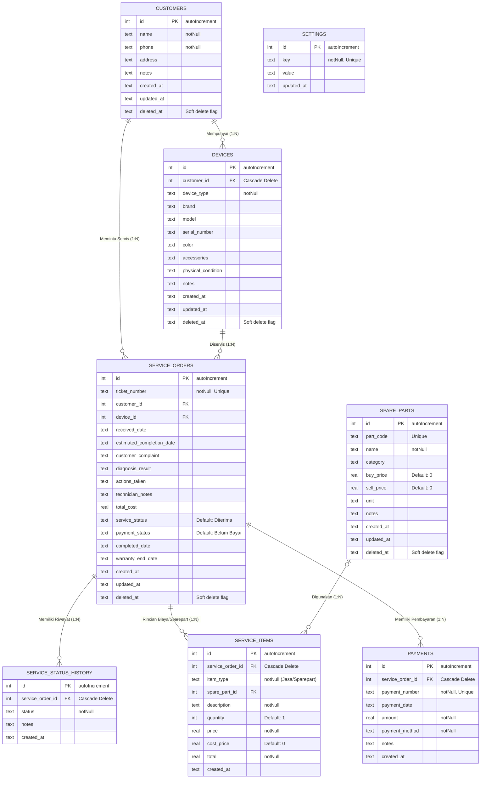

# Diagram Skema Database (ERD)

Aplikasi **nuNox Servis** menggunakan **SQLite** sebagai database lokal, yang diorkestrasikan menggunakan **Drizzle ORM** untuk menjamin *Type-Safety*. 
Di bawah ini adalah ilustrasi **Entity Relationship Diagram (ERD)** dari skema database:

## Penjelasan Relasi (Relationships)

1. **Pelanggan & Perangkat (1:N)**: Satu `Customer` dapat mendaftarkan banyak `Device`. Penghapusan Pelanggan bersifat *Soft Delete*, sehingga perangkat tetap terhubung di database namun disembunyikan.
2. **Servis & Perangkat**: Setiap `Service_Order` wajib merujuk kepada 1 `Customer` dan 1 `Device` tertentu.
3. **Servis & Item/Sparepart**: Setiap Servis bisa memiliki banyak Rincian Biaya (`Service_Items`), baik itu berupa "Jasa" maupun "Sparepart".
4. **Riwayat Status & Pembayaran**: Sistem akan mencatat riwayat perubahan status (`Service_Status_History`) dan terminasi pembayaran (`Payments`) secara terpisah.

File migrasi dan pengaturan Drizzle dapat ditemukan di folder `database/drizzleSchema.ts`.
