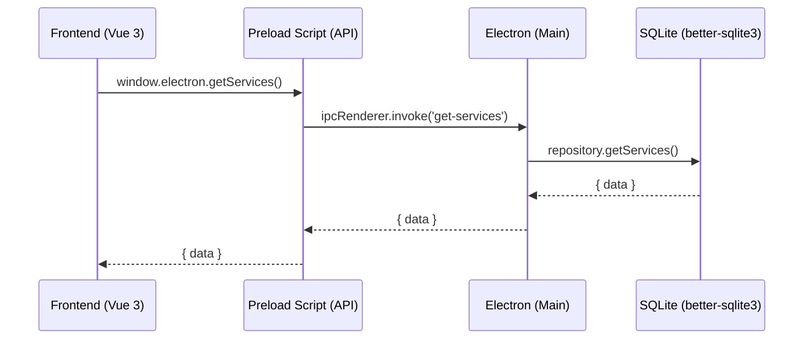

# Arsitektur nuNox Servis

Dokumen ini ditujukan untuk memandu *developer* atau kontributor baru untuk memahami cara kerja aplikasi ini di bawah kap (*under the hood*).

## High-Level Architecture

nuNox Servis menggunakan arsitektur aplikasi hibrida desktop yang mengawinkan **Electron (Node.js)** sebagai *backend* lokal dan **Vue 3 (Vite)** sebagai *frontend*.

1. **Frontend (Vue 3)**: Bertanggung jawab pada presentasi UI (antarmuka pengguna), *routing*, dan *state management* (menggunakan Pinia). 
2. **Backend (Electron Main Process)**: Bertanggung jawab pada operasi *file system*, eksekusi transaksi database, dan *bridging* ke sistem operasi Windows/Linux.
3. **Database (SQLite)**: Menyimpan seluruh entitas (*Services*, *Customers*, *Parts*) dalam bentuk file tunggal secara lokal yang sangat ringan dan portabel.

## Alur Data (Data Flow & IPC)

Sistem ini sangat bergantung pada konsep komunikasi antar-proses (IPC - *Inter-Process Communication*) bawaan Electron:



### 1. Lapisan Akses (Frontend)
Pada direktori `src/`, aplikasi Vue **tidak pernah** melakukan kontak langsung ke database. Vue hanya memanggil fungsionalitas yang terekspos di objek global: `window.electron`. 
Contoh:
```javascript
const services = await window.electron.getServices();
```

### 2. Jembatan IPC (Preload Script)
Berada di `electron/preload.js`. Lapisan ini mendaftarkan fungsi keamanan (`contextBridge`) agar *Frontend* tidak bisa mengeksekusi sembarang perintah *Node.js*.

### 3. Eksekusi Handler (Controllers)
Berada di `controllers/`. Di sini, Electron mendengarkan panggilan dari *Frontend* (melalui `ipcMain.handle()`) dan meneruskannya ke fungsi repositori. 

### 4. Lapisan Repositori (Drizzle ORM + better-sqlite3)
Berada di `repositories/`. Di lapisan ini, kita menggunakan [Drizzle ORM](https://orm.drizzle.team/) untuk melakukan kueri ke SQLite (via `better-sqlite3`). Penggunaan Drizzle memastikan operasi berbasis *Type-Safe*.

Contoh kueri Drizzle:
```typescript
db.drizzle.select().from(services).where(eq(services.status, 'Selesai')).all();
```

## Struktur Direktori Utama

- `public/` - Aset statis dan *styling* dasar (`style.css`).
- `src/` - Seluruh komponen, halaman (views), dan logika *Frontend* (Vue).
- `electron/` - *Main process* Electron dan *preload script*.
- `database/` - Skema Drizzle ORM (`drizzleSchema.js`) dan inisialisasi koneksi `better-sqlite3`.
- `repositories/` - Modul khusus abstraksi *database* (CRUD).
- `controllers/` - Pendaftaran *event-listener* IPC yang menyambungkan *Frontend* ke *repositories*.

## Mode Development

Saat menjalankan perintah `npm run dev:all`, ada dua entitas yang berjalan secara paralel:
1. **Vite Dev Server**: Melayani file Vue di `localhost` agar mendukung *Hot Module Replacement* (HMR).
2. **Electron Watcher**: Mengawasi perubahan file TypeScript/JavaScript di *Backend*. Jika ada perubahan, server Electron akan memuat ulang (melalui *electron-reload*).
