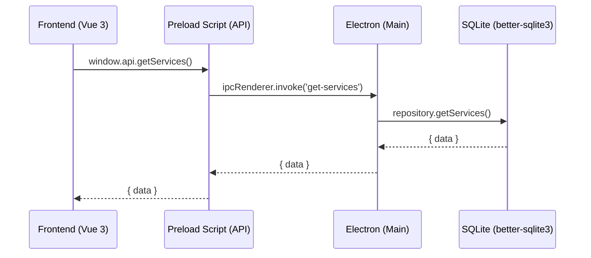

# Arsitektur nuNox Servis

Dokumen ini ditujukan untuk memandu _developer_ atau kontributor baru untuk memahami cara kerja aplikasi ini di bawah kap (_under the hood_).

## High-Level Architecture

nuNox Servis menggunakan arsitektur aplikasi hibrida desktop yang mengawinkan **Electron (Node.js)** sebagai _backend_ lokal dan **Vue 3 (Vite)** sebagai _frontend_.

1. **Frontend (Vue 3)**: Bertanggung jawab pada presentasi UI (antarmuka pengguna), _routing_, dan _state management_ (menggunakan Pinia).
2. **Backend (Electron Main Process)**: Bertanggung jawab pada operasi _file system_, eksekusi transaksi database, dan _bridging_ ke sistem operasi Windows/Linux.
3. **Database (SQLite)**: Menyimpan seluruh entitas (_Services_, _Customers_, _Parts_) dalam bentuk file tunggal secara lokal yang sangat ringan dan portabel.

## Alur Data (Data Flow & IPC)

Sistem ini sangat bergantung pada konsep komunikasi antar-proses (IPC - _Inter-Process Communication_) bawaan Electron:



### 1. Lapisan Akses (Frontend)

Pada direktori `src/`, aplikasi Vue **tidak pernah** melakukan kontak langsung ke database. Vue hanya memanggil fungsionalitas yang terekspos di objek global: `window.api`.
Contoh:

```javascript
const services = await window.api.getServices()
```

### 2. Jembatan IPC (Preload Script)

Berada di `electron/preload.js`. Lapisan ini mendaftarkan fungsi keamanan (`contextBridge`) agar _Frontend_ tidak bisa mengeksekusi sembarang perintah _Node.js_.

### 3. Eksekusi Handler (Controllers)

Berada di `controllers/`. Di sini, Electron mendengarkan panggilan dari _Frontend_ (melalui `ipcMain.handle()`) dan meneruskannya ke fungsi repositori.

### 4. Lapisan Repositori (Drizzle ORM + better-sqlite3)

Berada di `repositories/`. Di lapisan ini, kita menggunakan [Drizzle ORM](https://orm.drizzle.team/) untuk melakukan kueri ke SQLite (via `better-sqlite3`). Penggunaan Drizzle memastikan operasi berbasis _Type-Safe_.

Contoh kueri Drizzle:

```typescript
db.drizzle.select().from(services).where(eq(services.status, 'Selesai')).all()
```

## Struktur Direktori Utama

- `public/` - Aset statis dan _styling_ dasar (`style.css`).
- `src/` - Seluruh komponen, halaman (views), dan logika _Frontend_ (Vue).
- `electron/` - _Main process_ Electron dan _preload script_.
- `database/` - Skema Drizzle ORM (`drizzleSchema.ts`) dan inisialisasi koneksi `better-sqlite3`.
- `repositories/` - Modul khusus abstraksi _database_ (CRUD).
- `controllers/` - Pendaftaran _event-listener_ IPC yang menyambungkan _Frontend_ ke _repositories_.

## Mode Development

Saat menjalankan perintah `npm run dev:all`, ada tiga entitas yang berjalan secara paralel (melalui `concurrently`):

1. **Vite Dev Server** (`dev:vite`): Melayani file Vue di `localhost:5173` agar mendukung _Hot Module Replacement_ (HMR).
2. **TypeScript Compiler Watch** (`dev:electron:watch`): Mengawasi perubahan file TypeScript di _Backend_ dan mengompilasinya secara otomatis ke direktori `dist-electron/`.
3. **Electron Runner** (`dev:electron:start`): Menjalankan aplikasi Electron melalui `nodemon` yang akan memuat ulang otomatis setiap kali ada perubahan file hasil kompilasi.
